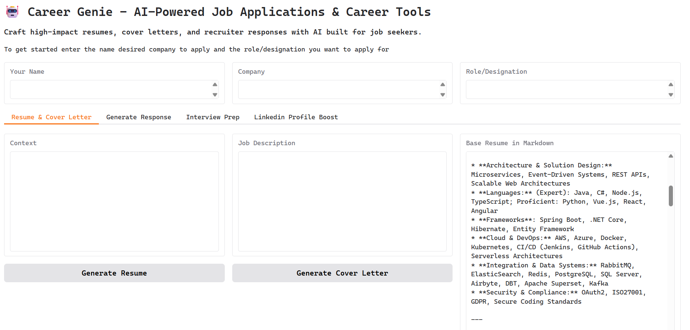
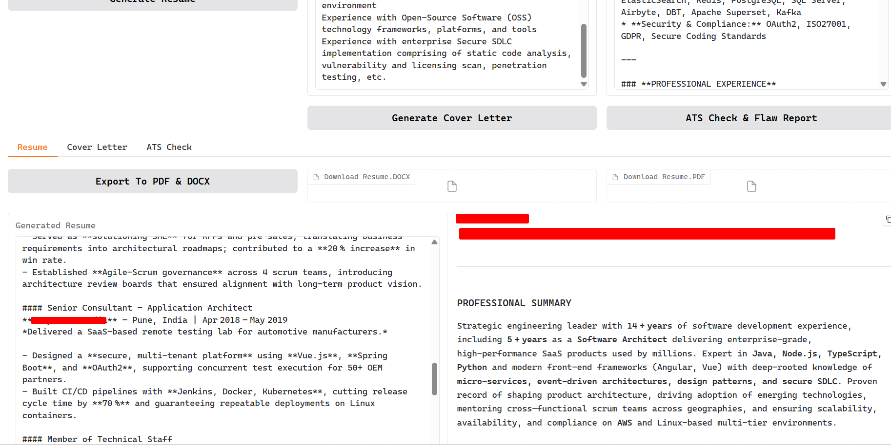
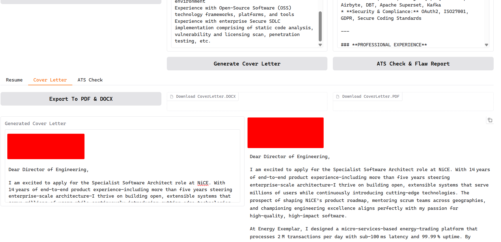
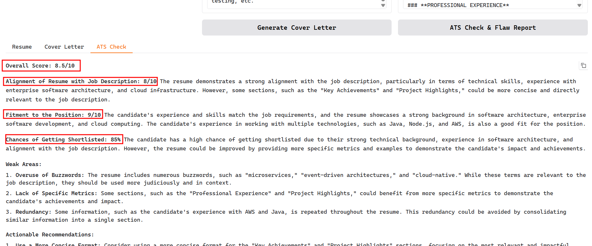
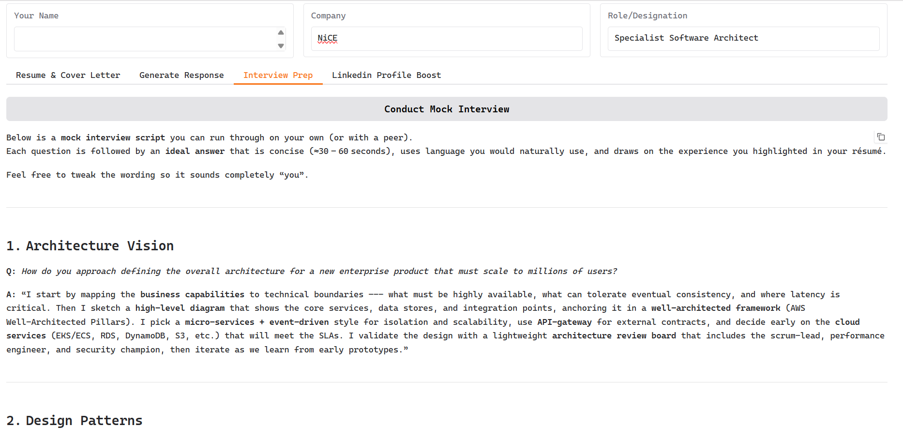
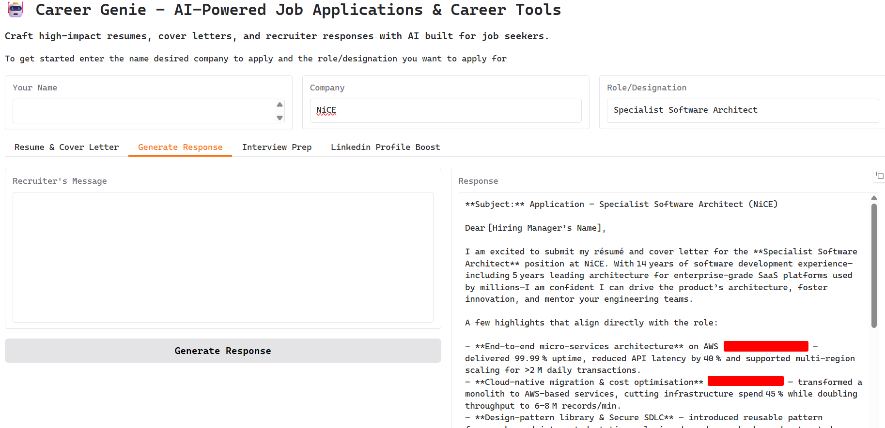

# 🚀 Career Genie

A comprehensive AI-powered web application designed to assist job seekers in optimizing their career materials and communication. Built with **Python**, **Gradio**, and integrated with **Groq APIs** for advanced language model capabilities.

This project is currently in **active development**, providing a robust platform for self-hosting or local execution.

## Table of Contents

- [Features](#-features)
- [Architecture](#-architecture)
- [Capabilities](#capabilities)
- [Prerequisites](#-prerequisites)
- [Installation](#-installation)
- [Configuration](#-configuration)
- [Usage](#-usage)
- [Development](#-development)
- [Contributing](#-contributing)
- [License](#-license)

---

## 📌 Features

- 🔌 **Groq API Integration**: Seamless connection to Groq's high-performance LLM inference services
- 🧪 **Local Development Environment**: Straightforward setup for developers and contributors
- 🐳 **Docker Containerization**: Easy deployment and self-hosting capabilities
- ⚙️ **Flexible Configuration**: Environment-based settings via `.env` files
- 💻 **Intuitive Web Interface**: Modern Gradio-based UI for user-friendly interaction
- 📄 **Multi-format Export**: Generate and download documents in DOCX and PDF formats
- 🤖 **AI-Powered Content Generation**: Leverages state-of-the-art language models for personalized outputs

## Capabilities

- **Resume & Cover Letter Generation**: Create tailored, ATS-optimized resumes and compelling cover letters based on specific job descriptions and user context
- **ATS Compatibility Analysis**: Evaluate resume effectiveness against Applicant Tracking Systems with detailed feedback and optimization recommendations
- **Document Export**: Seamlessly convert generated content to professional DOCX and PDF formats
- **Recruiter Communication**: Generate impactful, concise email responses to recruiter inquiries
- **Interview Preparation**: Conduct mock technical interviews with AI-generated questions and model answers
- **LinkedIn Profile Optimization**: Craft professional "About Me" sections and connection request messages

## 🏗️ Architecture

The application follows a modular, service-oriented architecture designed for maintainability and scalability:

### Core Components

- **Main Application (`src/app.py`)**: Gradio-based web interface orchestrating user interactions
- **Configuration Management (`src/services/config.py`)**: Centralized config loading from JSON and environment variables
- **LLM Interface (`src/services/llm_interface.py`)**: Abstraction layer for LLM API interactions (Groq and local models)
- **Service Modules**:
  - `resume.py`: Intelligent resume generation and optimization
  - `email_response.py`: Professional email composition for recruiter communications
  - `ats.py`: ATS compatibility analysis and improvement suggestions
  - `profile.py`: LinkedIn profile enhancement and interview preparation
  - `utils.py`: File processing utilities and export functionality

### Data Flow

1. User inputs job descriptions, personal details, and context via the web UI
2. Configuration is loaded and LLM services are initialized
3. Service modules process requests using configured prompts and AI models
4. Generated content is formatted and made available for download or display

---

## 🔧 Prerequisites

Before running the Job Seeker's Assistant, ensure you have the following:

- **Python 3.8+** (3.13+ recommended)
- **Groq API Key**: Obtain from [Groq Console](https://console.groq.com/)
- **Git**: For cloning the repository
- **Docker** (optional, for containerized deployment)

### Dependencies

The application relies on several Python packages:

- `gradio`: Web interface framework
- `requests`: HTTP client for API calls
- `python-dotenv`: Environment variable management
- `pypandoc`: Document conversion utilities
- `pathlib`: File system operations

All dependencies are listed in `requirements.txt`.

---

## 📦 Installation

### Option 1: Local Development Setup

1. **Clone the Repository**

   ```bash
   git clone https://github.com/iam-xtreme/side-projects.git
   cd side-projects/career-genie
   ```

2. **Create Virtual Environment**

   ```bash
   python3 -m venv venv
   source venv/bin/activate  # On Windows: venv\Scripts\activate
   ```

3. **Install Dependencies**

   ```bash
   pip install -r requirements.txt
   ```

### Option 2: Docker Deployment

1. **Build Docker Image**

   ```bash
   docker build -t career-genie .
   ```

2. **Run Container**

   ```bash
   docker run --env-file .env -p 7860:7860 career-genie
   ```

---

## ⚙️ Configuration

### Environment Variables

The application requires configuration via environment variables for secure API key management.

1. Copy the template file:

   ```bash
   cp .env.template .env
   ```

2. Edit `.env` and add your Groq API key:

   ```
   llm.groq.apiKey=your_groq_api_key_here
   llm.use=groq
   ```

**Required Variables:**

- `llm.groq.apiKey`: Your Groq API authentication key
- `llm.use`: LLM provider selection (default: groq)

**Note:** The `.env` file is mandatory for application startup and should not be committed to version control.

### Configuration Files

- `data/config.json`: Contains application settings, prompts, and model configurations
- `data/base-resume.md`: Template resume content
- `data/prompts/`: Directory containing AI prompt templates

---

## 🚀 Usage

### Starting the Application

**Local Development:**

```bash
python src/app.py
```

**Docker:**

```bash
docker run --env-file .env -p 7860:7860 career-genie
```

Access the web interface at `http://localhost:7860`

### User Interface Overview

The application provides a tabbed interface with the following sections:

1. **Resume & Cover Letter**: Generate customized career documents
2. **Generate Response**: Create professional email communications
3. **Interview Prep**: Practice with AI-generated interview scenarios
4. **LinkedIn Profile Boost**: Optimize professional networking content

### Workflow

1. Input job description and personal details
2. Generate tailored content using AI
3. Review and refine outputs
4. Export documents in desired formats

---

## Screenshots

<table>
  <tr>
    <td></td>
    <td></td>
    <td></td>
  </tr>
  <tr>
    <td></td>
    <td></td>
    <td></td>
  </tr>
</table>

---

## 🛠️ Development

### Project Structure

```
career-genie/
├── src/
│   ├── app.py                 # Main Gradio application
│   └── services/              # Service modules
│       ├── ats.py             # ATS analysis
│       ├── config.py          # Configuration management
│       ├── email_response.py  # Email generation
│       ├── llm_interface.py   # LLM API abstraction
│       ├── profile.py         # Profile optimization
│       ├── resume.py          # Resume generation
│       └── utils.py           # Utilities
├── data/
│   ├── config.json            # Application configuration
│   ├── base-resume.md         # Resume template
│   └── prompts/               # AI prompt templates
├── Dockerfile                 # Container definition
├── requirements.txt           # Python dependencies
└── README.md                  # This file
```

### Development Notes

- **Hot Reloading**: Not enabled by default; restart server after code changes
- **Testing**: Currently in development phase; APIs and UI may evolve
- **Logging**: Console output provides execution feedback
- **File Management**: Temporary files are automatically cleaned up

### API Reference

While the application is primarily UI-driven, the core services can be used programmatically:

```python
from services.config import Config
from services.resume import Resume
from services.llm_interface import LLMInterface

config = Config()
llm = LLMInterface(config.get('llm'))
resume_service = Resume(config.get('prompts.resume'), llm)

# Generate resume
result = resume_service.generate(job_description, company, title, context)
```

---

## 🤝 Contributing

We welcome contributions to improve the Job Seeker's Assistant!

### How to Contribute

1. Fork the repository
2. Create a feature branch: `git checkout -b feature/your-feature-name`
3. Make your changes and test thoroughly
4. Commit with descriptive messages: `git commit -m "Add feature description"`
5. Push to your branch: `git push origin feature/your-feature-name`
6. Submit a Pull Request

### Development Guidelines

- Follow PEP 8 style guidelines
- Add type hints where appropriate
- Include docstrings for new functions
- Test changes locally before submitting
- Update documentation for significant changes

### Reporting Issues

- Use GitHub Issues for bug reports and feature requests
- Provide detailed reproduction steps
- Include relevant error messages and system information

---

## 📄 License

This project is licensed under the MIT License - see the [LICENSE](LICENSE) file for details.

---

## 🙏 Acknowledgments

- [Groq](https://groq.com/) for providing high-performance LLM inference
- [Gradio](https://gradio.app/) for the intuitive web interface framework
- [Pandoc](https://pandoc.org/) for document conversion capabilities
